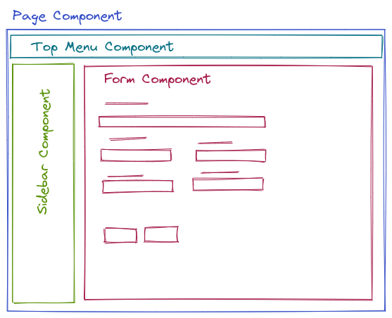
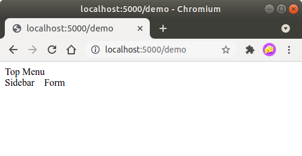

# Jembe Web Framework

Jembe is a Python Web Framework for developing modern web applications, build on top of Flask, and designed with the following goals:

- Web Frontend/UI is created by combing and nesting configurable, reusable, and adaptable UI components;
- UI Component is responsible for rendering one part of a web page and handling all user interaction regarding that part of the page;
- New UI components are created by extending Component class, and writing associated Jinja2 template;
- There should be no reason to think about, consider or implement the logic for:
    - Handling HTTP request-response cycle;
    - URL Routing;
    - Handling any "low level" web/HTTP API;
- Complex UI behaviors and user interactions are handled with minimal javascript code, using server-side HTML rendering and partial page updating, allowing the majority of UI and all business logic to be written in Python and executed on the server;
- Once a set of "basic" UI components is created Developer should be able to stay focused primarily on "business" logic and write new UI/Frontend logic only for specific use cases;

Official web site https://jembe.io

## Quickstart 

### Install Jembe Framework 

> Jembe requires **Python 3.8** or above.


``` bash
# Create project directory
$ mkdir myproject
$ cd myproject

# Create Python virtual enviroment and activate it
$ python -m venv .venv
$ . .venv/bin/activate 

# Install Jembe framework in newly created vritual enviroment
$ pip install jembe

# Start a new project with the premade project template
$ jembe startproject

# Install developer dependencies in a virtual environment
$ pip install -e .[dev]

# Run application
$ flask run
```

With broswer open http://localhost:5000 to view newly created jembe application. 

> Following examples assumes that the Jembe project is named **'myproject'** and it's created with `$ jembe startproject` command.

### Hello World Example

Create a simple Component to render a static HTML page.

##### myproject/pages/hello_world.py
``` python
from jembe import Component
from myproject.app import jmb

@jmb.page('hello')
class HellowWorld(Component):
    pass
```

##### myproject/templates/hello.html
``` jinja
<html>
<body>
    <h1>Hello World!</h1>
    <script src="{{ url_for('jembe.static', filename='js/jembe.js') }}"></script>
</body>
</html>
```

In `myproject/pages/__init__.py` add `from .hello_world import HelloWorld`.

Visit `http://localhost:5000/hello`.


### Making Hello World Dynamic

- Use Component **state variable** to represent the current state of the Component.
- Allow a user to update Component **state** by interacting with HTML input field.


##### myproject/pages/hello_world.py
``` python
from jembe import Component
from myproject.app import jmb

@jmb.page('hello')
class HellowWorld(Component):
    def __init__(self, name: str = "World"):
        super().__init__()
```

##### myproject/templates/hello.html
``` jinja
<html>
<body>
    <h1>Hello {{name}}!</h1>
    <input jmb-on:keydown.debounce="name = $self.value" value="{{name}}">

    <script src="{{ url_for('jembe.static', filename='js/jembe.js') }}"></script>
    <script defer>
    {# Adds CSRF protection to Jembe AJAX requests #}
    window.addEventListener('DOMContentLoaded', function(event){
        window.jembeClient.addXRequestHeaderGenerator(function () {
            return {'X-CSRFToken': window.jembeClient.getCookie("_csrf_token")};
        })
    })
    </script>
</body>
</html>
```


Notice that the input field doesn't lose focus when the page is updated.

> - First `script` tag is required only on Root/Page component, aka `@jmb.page(..)` Component;
> - Second `script` tag is required by `jembe startproject` template to add CSRF protection, and it is added only to Root/Page component;


### Counter Example

- Defines component **actions**.
- Execute **actions** when an user press button inside component HTML.
- Creates complex pages by nesting multiple components.


##### myproject/pages/counter.py
``` python
from jembe import Component, action, config
from myproject.app import jmb


class Counter(Component):
    def __init__(self, count:int = 0):
        super().__init__()

    @action
    def increase(self):
        self.state.count += 1

    @action
    def decrease(self):
        self.state.count -= 1


@jmb.page(
    "counter",
    Component.Config(
        components={
            "counter": Counter
        }
    )
)
class CounterPage(Component):
    pass
```

In `myproject/pages/__init__.py` add `from .counter import CounterPage`.

##### myproject/templates/counter/counter.html
``` jinja
<h2>Counter</h2>
<div>
    Value: {{count}}
    <button jmb-on:click="decrease()" type="button">-</button>
    <button jmb-on:click="increase()" type="button">+</button>
</div>
```

##### myproject/templates/counter.html
``` jinja
<html>
<body>
    {{component('counter')}}

    <script src="{{ url_for('jembe.static', filename='js/jembe.js') }}"></script>
    <script defer>
    {# Adds CSRF protection to Jembe AJAX requests #}
    window.addEventListener('DOMContentLoaded', function(event){
        window.jembeClient.addXRequestHeaderGenerator(function () {
            return {'X-CSRFToken': window.jembeClient.getCookie("_csrf_token")};
        })
    })
    </script>
</body>
</html>
```


When increasing/decreasing counter, Jembe only renderers and updated Counter Component HTML, the rest of the HTML on the page is not changed.


### Multiple Counters Example

- Changes component configuration, instructing Jembe that URL should not be changed when the component is displayed on the page;
- Communicate between components using events and listeners.
- Use multiple instances of the same component on a page.

##### myproject/pages/multi_counter.py
``` python
from jembe import Component, Event, action, config, listener
from myproject.app import jmb

@config(Component.Config(changes_url=False))
class Counter(Component):
    def __init__(self, count:int = 0):
        super().__init__()

    @action
    def increase(self):
        self.state.count += 1
        self.emit("updateSum", value=1)

    @action
    def decrease(self):
        self.state.count -= 1
        self.emit("updateSum", value=-1)


@config(Component.Config(changes_url=False))
class CounterSum(Component):
    def __init__(self, sum:int = 0):
        super().__init__()

    @listener(event="updateSum")
    def on_update_sum(self, event:"Event"):
        self.state.sum += event.params["value"]


@jmb.page(
    'multicount',
    Component.Config(
        components={
            "counter": Counter,
            "sum": CounterSum,
        }
    )
)
class MultiCountPage(Component):
    pass
```

In `myproject/pages/__init__.py` add `from .multi_counter import MultiCountPage`.

##### myproject/templates/multicount/counter.html
``` jinja
<div>
    Counter {{key}}: {{count}}
    <button jmb-on:click="decrease()" type="button">-</button>
    <button jmb-on:click="increase()" type="button">+</button>
</div>
```

##### myproject/templates/multicount/sum.html
``` jinja
<div>
    <strong>Total: {{sum}}</strong>
</div>
```

##### myproject/templates/multicount.html
``` jinja
<html>
<body>
    {{component('counter').key('a')}}
    {{component('counter').key('b')}}
    {{component('counter').key('c')}}
    {{component('sum')}}

    <script src="{{ url_for('jembe.static', filename='js/jembe.js') }}"></script>
    <script defer>
    {# Adds CSRF protection to Jembe AJAX requests #}
    window.addEventListener('DOMContentLoaded', function(event){
        window.jembeClient.addXRequestHeaderGenerator(function () {
            return {'X-CSRFToken': window.jembeClient.getCookie("_csrf_token")};
        })
    })
    </script>
</body>
</html>
```


When the user changes the value of one Counter Component, only that Counter and CounterSum Component HTML are redisplayed and updated.


## Installation and Configuration

Jembe is installed into python environment with pip command:

``` bash
$ pip install jembe
```

> When developing or deploying python projects it is recomended to use diferent python virtual enviroment for every project.
>
> ```bash 
> # create new virtual enviroment
> $ python -m venv .venv
> # activate virtual enviroment
> $ . .venv/bin/activate
> # install jembe into active virtual enviroment
> (.venv) $ pip install jembe
> ```

To create Web Application with Jembe you must:
- create Flask Application and initialize Jembe as a regular Flask extension;
- registrer Root/Page Components to Jembe extension instance;
- add `script` tag to Root/Page Components HTML template.

### A Minimal Jembe Application

``` python
from flask import Flask, redirect
from jembe import Component, page_url

app = Flask(__name__)
jmb = Jembe(app)


@jmb.page("main")
class MainPage(Component):
    def display():
        return self.render_template_string("""
<html>
<body>
    <h1>Welcome from Jembe</h1>
    <script src="{{ url_for('jembe.static', filename='js/jembe.js') }}" defer></script>
</body>
</html>
        """)


@app.route("/")
def index():
    return redirect(page_url("/main"))
```
What the code do?

1. First we imported **Flask** class and **Component** classs together with **redirect** and **page_url** functions.
2. Next we create an instance of Flask class, this instance will be our application. The first argument is the name of the application's module or package, it's needed for Flask to knows where to look for resources such as templates and static files.
3. We then create an instance of Jembe class, this instance will initialise and manage Jembe Components. The first argument is the instance of associated Flask application.
4. Then we use **page** decorator to register MainPage class to Jembe instance.
    1. Registring page to Jembe instance tells Jembe that this component is part of our web application and what URL should display it.
    2. Component **display** method returns HTML that we want to display in user's browser. To create HTML we used inline rendering of Jinja2 template. We could also use regular string if we wanted.
    3. Because we registred this component as page it's HTML contains `script` tag to include JavaScript. 
5. Lastly we use **route()** decorator to tell Flask what URL should triger our **index** function that will redirect browser to our Jembe Page Componnet "main".

To run this application use:

``` bash
$ export FLASK_APP=minimal
$ flask run
 * Running on http://127.0.0.1:5000/
```


### Use Flask Application Factory 

When we create application with Jembe Components we  can anticipiate that lots of components will used. We can imporove development expirence by using Flask Application Factory pattern to create our application.


### Use Jembe Application Template


### Adding Jembe to an Existing Flask Project

> Adding Jembe Components in the regular Flask view is not currently supported. Entire HTML pages should be build from Jembe Components. 
>
> One Component should be responsible for rendering HTML HEAD and BODY tags, and all other Components are rendered inside this Component to form a web application.

To integrate Jembe into an existing Flask project we must:
 
#### Registred and initialize Jembe as Flask extension;

```python
"""When Flask is statically loaded"""
from jembe import Jembe

app = Flask(__name__)
jmb = Jembe(app)
```

```python
"""When Flask is dynamically loaded"""
from jembe import Jembe

jmb = Jembe()

def create_app(config):
    # ...
    app = Flask(__name__)
    jmb.init_app(app)
```    

#### Register Top Level @jmb.page Components to Jembe Instance

```python
"""Using 'page' decorator"""
from jembe import Component
# from [place where you have defined jmb as jmb = Jembe(..)] import jmb

@jmb.page("main")
class PageComponent(Component):
    pass
```
```python
"""Using add_page method"""
from jembe import Jembe

jmb = Jembe()

def create_app(config):
    from .pages import PageComponent
    # ...
    app = Flask(__name__)
    jmb.init_app(app)
    #..
    jmb.add_page("main", PageComponent)
```

#### Add necessary javascript to @jmb.page Component HTML/Jinja2 template

Default template for @jmba.page Component registred as 'main' is 'main.html' 

```html
<!-- templates/main.html -->
<html>
<head>
<!-- ... -->
</head>
<body>
<!-- ... -->
    <script src="{{ url_for('jembe.static', filename='js/jembe.js') }}" defer></script>
</body>
<html>
```

## Jembe Component Essentials

Jembe Component is the primary building block for creating Web Application Frontend. Components are combined/nested to create a Web Application User Interface.

Components are combined in a hierarchy. At least one component will be Root/Page Component.



 Web application can have multiple Root/Page Components if needed.

Jembe Component is made of two main parts:
- **Component.Config class** 
    - responsible for:
        - configuring the behavior of te Component class instances;
    - it's initialized:
        - only once for every registred component, when an application is started;
- **Component class** 
    - responsible for:
        - rendering part of the HTML page;
        - handling user interaction with that part of the page;
    - initalized:
        - on every HTTP request (user interaction) with application when that specific component is displayed.


The following example creates a simplified web application with one Root/Page component and three subcomponents.

##### myproject/pages/main.py
``` python
from jembe import Component
from myproject.app import jmb

class TopMenuComponent(Component):
    pass

class SidebarComponent(Component):
    pass

class FormComponent(Component):
    pass

class PageComponent(Component):
    class Config(Component.Config):
        def __init__(
            self,
            template=None, 
            components=None, 
            inject_into_components=None,
            redisplay=(), 
            changes_url=True, 
            url_query_params=None
        ):
            # Adds three subcomponent to PageComponent named
            # top, side and form
            if components is None:
                components = {}
            components["top"] = TopMenuComponent
            components["side"] = SidebarComponent
            components["form"] = FormComponent
            
            super().__init__(
                template=template, 
                components=components, 
                inject_into_components=inject_into_components, 
                redisplay=redisplay, 
                changes_url=changes_url, 
                url_query_params=url_query_params
            )

# Registers PageComponent as Root Component of Web application
jmb.add_page("demo", PageComponent)

# Since PageComponent is registred as "demo" it's default template is:
# - demo.html

# Subcomponents "top", "side" and "form" will use:
# - demo/top.html
# - demo/side.html
# - demo/form.html
# as their default templates respectivly.
```
##### myproject/templates/demo.html
``` html
<html>
    <head></head>
    <body>
        <div>{{component("top")}}</div>
        <div style="display:flex; gap:16px;">
            <div>{{component("side")}}</div>
            <div>{{component("form")}}</div>
        </div>
    </body>
<html>
```

##### myproject/templates/demo/top.html
``` html
<div>Top Menu</div>
```

##### myproject/templates/demo/side.html
``` html
<div>Sidebar</div>
```
##### myproject/templates/demo/form.html
``` html
<div>Form</div>
```


Configuring PageComponent by extending the Component class, like in the example above, is the most powerful and flexible way to configure a Component's behavior, and it's usually used when creating new components to add additional configuration parameters.

To combine existing components it's easier and less verbose to use `page` decorator:

```python
from jembe import Component
from myproject.app import jmb

class TopMenuComponent(Component):
    pass

class SidebarComponent(Component):
    pass

class FormComponent(Component):
    pass

@jmb.page("main",
    Component.Config(
        components=dict(
            top=TopMenuComponent,
            side=SidebarComponent,
            form=FormComponent
        )
    ))
class PageComponent(Component):
    pass
```

> Component instance can access its Config class using `_config` attribute.

### Registring Components 


### Rendering

Default 

### Component State Params

### Actions

### Events

## Reference

### Component

### Component.Config

### Component JS Client


## License


Jembe Web Framework 
Copyright (C) 2021 BlokKod <info@blokkod.me>

This program is free software: you can redistribute it and/or modify
it under the terms of the GNU Lesser General Public License as published
by the Free Software Foundation, either version 3 of the License, or
(at your option) any later version.

This program is distributed in the hope that it will be useful,
but WITHOUT ANY WARRANTY; without even the implied warranty of
MERCHANTABILITY or FITNESS FOR A PARTICULAR PURPOSE.  See the
GNU Lesser General Public License for more details.

You should have received a copy of the GNU Lesser General Public License
along with this program.  If not, see <https://www.gnu.org/licenses/>.
